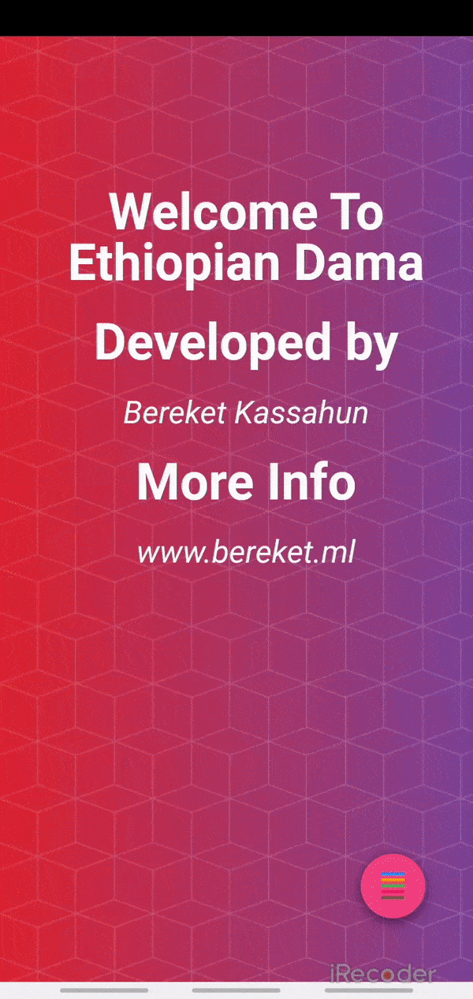

MAIN ALGORITHM
this game uses minmax algorithm with alpha beta purning, and it is found in utils.kt

HOW TO PLAY
1. red box are for the AI and blue boxes are for the player
2. you can move your boxes on any of line edges that are not occupied
3. make straight line to win

LEVELS
	it have three levels 
		1.Easy :- you can simply win it
		2.Normal :- Little harder to win
		3.Hard :- Unbeatable
	

  
